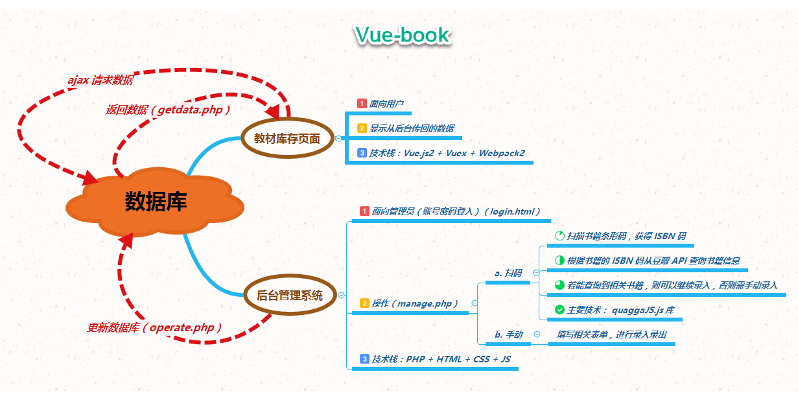

# Vue-book

## 说明

* **前端: Vue.js + Vuex + Webpack2**
* **后端: php + MySQL**

本项目实现了一些简单的功能，后台可以对图书进行录入录出（扫码或手动），前台显示录入的图书。具体请看下面的实现逻辑图。

[](simple-logic.png)

我在自己的服务器上把这个项目搭建好了，但是，目前不便给出登录后台的链接，只给出前台的链接，本项目只针对移动端，所以最好在手机上查看链接 ^_^ [(前台链接)](http://www.percymong.com/book2)

## Build Setup

``` bash
# install dependencies
npm install

# serve with hot reload at localhost:8080
npm run dev

# build for production with minification
npm run build
```

> 我在本地测试用的服务器是 [WAMP Server](http://www.wampserver.com/en/)。

为了方便大家阅读源码，我列出了前后端数据交互时比较重要一些的接口，方便大家进行参考！[（点我查看）](additional.md)

## 项目目录说明

```bash
Vue-book directory
├── backend                     # 存放后台或后端文件
|  ├── css                          # 存放后台样式文件
|     ├── login.css                     # 登录后台页面的样式
|     ├── manage.css                    # 后台操作页面的一部分样式
|     ├── manual.css                    # 后台手动操作的样式
|     └── scan.css                      # 后台扫码操作的样式
|  ├── database_details.sql         # 生成指定数据库和表
|  ├── getdata.php                  # 前端获取数据时的后端脚本           
|  ├── js                           # 存放后台脚本文件
|     ├── manage.js                     # 进入管理界面的效果脚本
|     ├── manual.js                     # 后台手动操作的脚本
|     └── scan.js                       # 后台扫码操作的脚本
|  ├── login.html                   # 后台登录页面
|  ├── manage.php                   # 登录后台成功后返回的管理页面
|  └── operate.php                  # 定义后台操作与数据库交互的逻辑
├── src                         # 存放前端源码
|  ├── app.vue                      # 根组件
|  ├── common                       # 存放通用脚本或样式
|     └── getdata.js                    # 向后端获取数据的前端脚本
|  ├── components                   # 存放各种组件
|     ├── book-card.vue                 # 书籍详细信息
|     ├── book-item.vue                 # 书籍简要信息
|     ├── container.vue                 # 大包含块
|     ├── content.vue                   # 内容块
|     ├── header.vue                    # 页面头
|     ├── loading.vue                   # 加载中
|     ├── menu.vue                      # 左侧菜单栏
|     └── overlay.vue                   # 覆盖层
|  ├── fonts                        # 存放字体相关文件
|     ├── font.css                      # CSS 引入字体
|     ├── icomoon.eot
|     ├── icomoon.svg
|     ├── icomoon.ttf
|     ├── icomoon.woff
|     └── title.ttf
|  ├── main.js                      # 程序入口文件
|  ├── router                       # 路由
|     └── routes.js                     # 定义路由文件
|  └── vuex                         # Vuex 状态管理
|     └── store.js                      # 状态脚本
├── index.html                      
├── package.json                    # 配置项目相关信息
├── webpack.config.js               # Webpack 配置相关信息
├── README.md
```

## 待解决问题

* 切换内容页面时，默认滚动到内容最顶部（content.vue）
* 移动端，向下滑动显示全屏，向上滑动退出全屏
* 安全问题，防止 SQL 注入（operate.php）
* CS、js 文件合并压缩（后台页面 manage.php）

## Licence

MIT Licence
